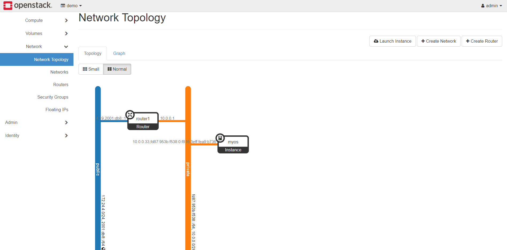

# OpenStack terraform code

Start with a fresh environment of openstack.
## Usage
Download code 

     git clone https://github.com/Harshetjain666/terraform-openstack-aws.git
Init terraform code (download openstack provider)

    cd openstack-terraform-code 
    terraform init

Install
   

    terraform apply
